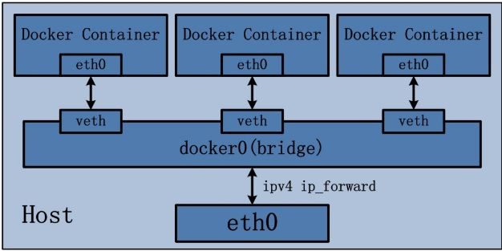
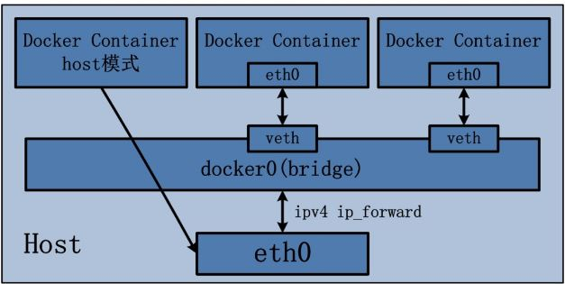
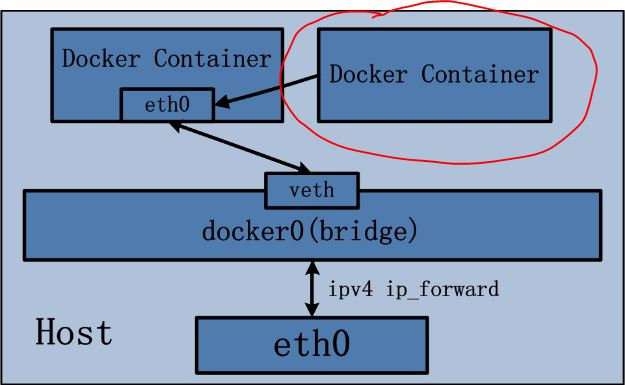

## 0 什么是容器

1. 容器就是将软件打包成标准化单元，以用于开发、交付和部署。
2. 容器镜像是轻量的、可执行的独立软件包 ，包含软件运行所需的所有内容：代码、运行时环境、系统工具、系统库和设置。
3. 容器化软件适用于基于Linux和Windows的应用，在任何环境中都能够始终如一地运行。
4. 容器赋予了软件独立性，使其免受外在环境差异（例如，开发和预演环境的差异）的影响，从而有助于减少团队间在相同基础设施上运行不同软件时的冲突。
5. 容器存放的东西更偏向于应用比如网站、程序甚至是系统环境。


## 1 什么是docker

### 1.1 docker的简介

1. Docker 使用 Google 公司推出的 Go 语言进行开发实现，基于 Linux 内核 的cgroup、namespace以及AUFS类的UnionFS等技术，对进程进行封装隔离，属于操作系统层面的虚拟化技术。由于隔离的进程独立于宿主和其它的隔离的进程，因此也称其为容器。Docke最初实现是基于 LXC。
2. Docker 能够自动执行重复性任务，例如搭建和配置开发环境，从而解放了开发人员以便他们专注在真正重要的事情上：构建杰出的软件。
3. 用户可以方便地创建和使用容器，把自己的应用放入容器。容器还可以进行版本管理、复制、分享、修改，就像管理普通的代码一样。

### 1.2 docker的特点

1. 上手快：用户只需要几分钟，就可以把自己的程序“Docker 化”。Docker 依赖于“写时复制” (copy-on-write)模型，使修改应用程序也非常迅速，可以说达到“随心所致，代码即改” 的境界。随后，就可以创建容器来运行应用程序了。大多数 Docker 容器只需要不到 1 秒中即可 启动。由于去除了管理程序的开销，Docker 容器拥有很高的性能，同时同一台宿主机中也 可以运行更多的容器，使用户尽可能的充分利用系统资源。
2. 职责的逻辑分类：使用 Docker，开发人员只需要关心容器中运行的应用程序，而运维人员只需要关心如何管理容器。Docker设计的目的就是要加强开发人员写代码的开发环境与应用程序要部署 的生产环境一致性。从而降低那种“开发时一切正常，肯定是运维的问题(测试环境都是正 常的，上线后出了问题就归结为肯定是运维的问题)”
3. 快速高效的开发生命周期：Docker 的目标之一就是缩短代码从开发、测试到部署、上线运行的周期，让你的应用程序具备可移植性，易于构建，并易于协作。(通俗一点说，Docker 就像一个盒子，里面 可以装很多物件，如果需要这些物件的可以直接将该大盒子拿走，而不需要从该盒子中一件 件的取。)
4. 鼓励使用面向服务的架构：Docker 还鼓励面向服务的体系结构和微服务架构。Docker 推荐单个容器只运行一个应 用程序或进程，这样就形成了一个分布式的应用程序模型，在这种模型下，应用程序或者服 务都可以表示为一系列内部互联的容器，从而使分布式部署应用程序，扩展或调试应用程序 都变得非常简单，同时也提高了程序的内省性。(当然可以在一个容器中运行多个应用程序)

### 1.3 使用docker的原因

1. 一致的运行环境：Docker 的镜像提供了除内核外完整的运行时环境，确保了应用运行环境一致性，从而不会再出现 “这段代码在我机器上没问题啊” 这类问题。
2. 更快速的启动时间：可以做到秒级、甚至毫秒级的启动时间，大大的节约了开发、测试、部署的时间。
3. 隔离性：避免公用的服务器，资源会容易受到其他用户的影响。
4. 弹性伸缩，快速扩展：善于处理集中爆发的服务器使用压力。
5. 迁移方便：可以很轻易的将在一个平台上运行的应用，迁移到另一个平台上，而不用担心运行环境的变化导致应用无法正常运行的情况。
6. 持续交付和部署：使用 Docker 可以通过定制应用镜像来实现持续集成、持续交付、部署。

### 1.4 docker基本概念

Docker 包括三个基本概念

- **镜像（Image）**：一个特殊的文件系统，除了提供容器运行时所需的程序、库、资源、配置等文件外，还包含了一些为运行时准备的一些配置参数（如匿名卷、环境变量、用户等）。
- **容器（Container）**：镜像运行时的实体，可以被创建、启动、停止、删除、暂停等 。
- **仓库（Repository）**：集中存放镜像文件的地方

docker的**Build, Ship, and Run**

- **Build（构建镜像）** ： 镜像就像是集装箱包括文件以及运行环境等等资源。
- **Ship（运输镜像）** ：主机和仓库间运输，这里的仓库就像是超级码头一样。
- **Run （运行镜像）** ：运行的镜像就是一个容器，容器就是运行程序的地方。

## 2 docker与VM的区别

### 2.1 功能对比

容器和虚拟机具有相似的资源隔离和分配优势，但功能有所不同，因为容器虚拟化的是操作系统，而不是硬件，因此容器更容易移植，效率也更高。传统虚拟机技术是虚拟出一套硬件后，在其上运行一个完整操作系统，在该系统上再运行所需应用进程；而容器内的应用进程直接运行于宿主的内核，容器内没有自己的内核，而且也没有进行硬件虚拟。因此容器要比传统虚拟机更为轻便。具体的对比图如下：


虚拟机具有完整的操作系统，其自身的内存管理通过相关的虚拟设备进行支持。在虚拟机中，为用户操作系统和虚拟机管理程序分配有效的资源，从而可以在单台计算机（或主机）上并行运行一个或多个操作系统的多个实例。 每个客户操作系统都作为主机系统中的单个实体运行。 

另一方面，Docker容器是使用Docker引擎而不是管理程序来执行的。 因此容器比虚拟机小，并且由于主机内核的共享，可以更快地启动，具有更好的性能，更少的隔离和更好的兼容性。 Docker容器能够共享一个内核并共享应用程序库，因此容器比虚拟机具有更低的系统开销，只要用户愿意使用单一平台来提供共享的操作系统，容器可以更快，更少资源。虚拟机可能需要几分钟才能创建并启动，而只需几秒钟即可创建并启动一个容器。与在虚拟机中运行应用程序相比，容器中包含的应用程序提供了卓越的性能。 

Docker容器比虚拟机弱的一个关键指标就是“隔离”。英特尔的VT-d和VT-x技术为虚拟机提供了ring-1硬件隔离技术，因此虚拟机可以充分利用它的优势。它可以帮助虚拟机器高效使用资源和防止相互干扰。 Docker容器还没有任何形式的硬件隔离，因此它们容易受到攻击。

### 2.2 性能对比

|    特性    |       docker       |     VM     |
| :--------: | :----------------: | :--------: |
|  启动时间  |        秒级        |   分钟级   |
|  硬盘使用  |        MB级        |    GB级    |
| 系统支持量 | 单机支持上千个容器 | 一般几十个 |

### 2.3 两者共存


## 3 docker网络

### 3.1 Docker 网络概况

用一张图来说明 Docker 网络的基本概况：


### 3.2 四种单节点网络模式

#### 3.2.1 bridge 模式

Docker 容器默认使用 bridge 模式的网络。其特点如下：

- 使用一个 linux bridge，默认为 docker0
- 使用 veth 对，一头在容器的网络 namespace 中，一头在 docker0 上
- 该模式下Docker Container不具有一个公有IP，因为宿主机的IP地址与veth pair的 IP地址不在同一个网段内
- Docker采用 NAT 方式，将容器内部的服务监听的端口与宿主机的某一个端口port 进行“绑定”，使得宿主机以外的世界可以主动将网络报文发送至容器内部
- 外界访问容器内的服务时，需要访问宿主机的 IP 以及宿主机的端口 port
- NAT 模式由于是在三层网络上的实现手段，故肯定会影响网络的传输效率。
- 容器拥有独立、隔离的网络栈；让容器和宿主机以外的世界通过NAT建立通信

iptables 的 SNTA 规则，使得从容器离开去外界的网络包的源 IP 地址被转换为 Docker 主机的IP地址：

```
Chain POSTROUTING (policy ACCEPT)
target     prot opt source               destination
MASQUERADE  all  --  172.17.0.0/16        0.0.0.0/0
MASQUERADE  all  --  172.18.0.0/16        0.0.0.0/0
```

效果是这样的：


示意图：



#### 3.2.2 Host 模式

定义：

Host 模式并没有为容器创建一个隔离的网络环境。而之所以称之为host模式，是因为该模式下的 Docker 容器会和 host 宿主机共享同一个网络 namespace，故 Docker Container可以和宿主机一样，使用宿主机的eth0，实现和外界的通信。换言之，Docker Container的 IP 地址即为宿主机 eth0 的 IP 地址。其特点包括：

- - 这种模式下的容器没有隔离的 network namespace
  - 容器的 IP 地址同 Docker host 的 IP 地址
  - 需要注意容器中服务的端口号不能与 Docker host 上已经使用的端口号相冲突
  - host 模式能够和其它模式共存

实验：

（1）启动一个 host 网络模式的容器

```
docker run -d --name hostc1 --network host -p 5001:5001 training/webapp python app.py
```

（2）检查其 network namespace，其中可以看到主机上的所有网络设备

[](javascript:void(0);)

```
root@docker2:/home/sammy# ln -s /proc/28353/ns/net /var/run/netns/hostc1
root@docker2:/home/sammy# ip netns
hostc1
root@docker2:/home/sammy# ip netns exec hostc1
No command specified
root@docker2:/home/sammy# ip netns exec hostc1 ip a
1: lo: <LOOPBACK,UP,LOWER_UP> mtu 65536 qdisc noqueue state UNKNOWN group default
    link/loopback 00:00:00:00:00:00 brd 00:00:00:00:00:00
    inet 127.0.0.1/8 scope host lo
       valid_lft forever preferred_lft forever
    inet6 ::1/128 scope host
       valid_lft forever preferred_lft forever
2: eth0: <BROADCAST,MULTICAST,UP,LOWER_UP> mtu 1500 qdisc pfifo_fast state UP group default qlen 1000
    link/ether 08:00:27:d4:66:75 brd ff:ff:ff:ff:ff:ff
    inet 192.168.1.20/24 brd 192.168.1.255 scope global eth0
       valid_lft forever preferred_lft forever
    inet6 fe80::a00:27ff:fed4:6675/64 scope link
       valid_lft forever preferred_lft forever
......
```

[](javascript:void(0);)

示意图：



#### 3.2.3 container 模式

定义：

 Container 网络模式是 Docker 中一种较为特别的网络的模式。处于这个模式下的 Docker 容器会共享其他容器的网络环境，因此，至少这两个容器之间不存在网络隔离，而这两个容器又与宿主机以及除此之外其他的容器存在网络隔离。  

实验：

（1）启动一个容器： 

docker run -d --name hostcs1 -p 5001:5001 training/webapp python app.py

（2）启动另一个容器，并使用第一个容器的 network namespace

docker run -d --name hostcs2 --network container:hostcs1  training/webapp python app.py

注意：因为此时两个容器要共享一个 network namespace，因此需要注意端口冲突情况，否则第二个容器将无法被启动。

示意图：



#### 3.2.4 none 模式

定义：

 网络模式为 none，即不为 Docker 容器构造任何网络环境。一旦Docker 容器采用了none 网络模式，那么容器内部就只能使用loopback网络设备，不会再有其他的网络资源。Docker Container的none网络模式意味着不给该容器创建任何网络环境，容器只能使用127.0.0.1的本机网络。

实验：

（1）创建并启动一个容器： docker run -d --name hostn1 --network none training/webapp python app.py

（2）检查其网络设备，除了 loopback 设备外没有其它设备

[](javascript:void(0);)

```
root@docker2:/home/sammy# ip netns exec hostn1 ip a
1: lo: <LOOPBACK,UP,LOWER_UP> mtu 65536 qdisc noqueue state UNKNOWN group default
    link/loopback 00:00:00:00:00:00 brd 00:00:00:00:00:00
    inet 127.0.0.1/8 scope host lo
       valid_lft forever preferred_lft forever
    inet6 ::1/128 scope host
       valid_lft forever preferred_lft forever
```

[](javascript:void(0);)

### 3.3 多节点 Docker 网络

  Docker 多节点网络模式可以分为两类，一类是 Docker 在 1.19 版本中引入的基于 VxLAN 的对跨节点网络的原生支持；另一种是通过插件（plugin）方式引入的第三方实现方案，比如 Flannel，Calico 等等。

#### 3.3.1 Docker 原生overlay 网络

  Docker 1.19 版本中增加了对 overlay 网络的原生支持。Docker 支持 Consul, Etcd, 和 ZooKeeper 三种分布式key-value 存储。其中，etcd 是一个高可用的分布式 k/v存储系统，使用etcd的场景默认处理的数据都是控制数据，对于应用数据，只推荐数据量很小，但是更新访问频繁的情况。

##### 3.3.1.1 安装配置

准备三个节点：

- devstack 192.168.1.18
- docker1 192.168.1.21
- docker2 192.168.1.19

在 devstack 上使用Docker 启动 etcd 容器：

[](javascript:void(0);)

```
export HostIP="192.168.1.18"
docker run -d -v /usr/share/ca-certificates/:/etc/ssl/certs -p 4001:4001 -p 2380:2380 -p 2379:2379 \
 --name etcd quay.io/coreos/etcd \
 /usr/local/bin/etcd \
 -name etcd0 \
 -advertise-client-urls http://${HostIP}:2379,http://${HostIP}:4001 \
 -listen-client-urls http://0.0.0.0:2379,http://0.0.0.0:4001 \
 -initial-advertise-peer-urls http://${HostIP}:2380 \
 -listen-peer-urls http://0.0.0.0:2380 \
 -initial-cluster-token etcd-cluster-1 \
 -initial-cluster etcd0=http://${HostIP}:2380 \
 -initial-cluster-state new
```

[](javascript:void(0);)

使用 Docker 启动 etcd 请参考 <https://coreos.com/etcd/docs/latest/docker_guide.html>。不过，应该是因为制造镜像所使用的Dockerfile 原因，官网上的命令因为少了上面红色字体部分而会造成启动失败：

```
 b847195507addf4fb5a01751eb9c4101416a13db4a8a835e1c2fa1db1e6f364e
docker: Error response from daemon: oci runtime error: exec: "-name": executable file not found in $PATH.
```

添加红色部分后，容器可以被正确创建：

```
root@devstack:/# docker exec -it 179cd52b494d /usr/local/bin/etcdctl cluster-health
member 5d72823aca0e00be is healthy: got healthy result from http://:2379
cluster is healthy
```

[](javascript:void(0);)

```
root@devstack:/home/sammy# docker ps
CONTAINER ID        IMAGE                 COMMAND                  CREATED             STATUS              PORTS                                                      NAMES
179cd52b494d        quay.io/coreos/etcd   "/usr/local/bin/etcd "   8 seconds ago       Up 8 seconds        0.0.0.0:2379-2380->2379-2380/tcp, 0.0.0.0:4001->4001/tcp   etcd
root@devstack:/home/sammy# netstat -nltp | grep 2380
tcp6       0      0 :::2380                 :::*                    LISTEN      4072/docker-proxy
root@devstack:/home/sammy# netstat -nltp | grep 4001
tcp6       0      0 :::4001                 :::*                    LISTEN      4047/docker-proxy
```

[](javascript:void(0);)

在docker1 和 docker2 节点上修改 /etc/default/docker，添加：

```
DOCKER_OPTS="--cluster-store=etcd://192.168.1.18:2379 --cluster-advertise=192.168.1.20:2379"
```

然后分别重启 docker deamon。注意，要使用IP地址；要是使用 hostname 的话，docker 服务将启动失败：

```
root@docker2:/home/sammy# docker ps
An error occurred trying to connect: Get http://%2Fvar%2Frun%2Fdocker.sock/v1.24/containers/json: read unix @->/var/run/docker.sock: read: connection reset by peer
```

##### 3.3.1.2 使用 Docker overlay 网络

（1）在docker1上运行下面的命令创建一个 overlay 网络：

[](javascript:void(0);)

```
root@docker1:/home/sammy# docker network create -d overlay overlaynet1
1de982804f632169380609b9be7c1466b0064dce661a8f4c9e30d781e79fc45a
root@docker1:/home/sammy# docker network inspect overlaynet1
[
    {
        "Name": "overlaynet1",
        "Id": "1de982804f632169380609b9be7c1466b0064dce661a8f4c9e30d781e79fc45a",
        "Scope": "global",
        "Driver": "overlay",
        "EnableIPv6": false,
        "IPAM": {
            "Driver": "default",
            "Options": {},
            "Config": [
                {
                    "Subnet": "10.0.0.0/24",
                    "Gateway": "10.0.0.1/24"
                }
            ]
        },
        "Internal": false,
        "Containers": {},
        "Options": {},
        "Labels": {}
    }
]
```

[](javascript:void(0);)

在 docker2 上你也会看到这个网络，说明通过 etcd，网络数据是分布式而不是本地的了。

（2）在网络中创建容器

在 docker2 上，运行 docker run -d --name over2 --network overlaynet1 training/webapp python app.py

在 docker1 上，运行 docker run -d --name over1 --network overlaynet1 training/webapp python app.py

进入容器 over2，发现它有两块网卡：

[](javascript:void(0);)

```
root@docker2:/home/sammy# ln -s /proc/23576/ns/net /var/run/netns/over2
root@docker2:/home/sammy# ip netns
over2
root@docker2:/home/sammy# ip netns exec over2 ip a

22: eth0: <BROADCAST,MULTICAST,UP,LOWER_UP> mtu 1450 qdisc noqueue state UP group default
    link/ether 02:42:0a:00:00:02 brd ff:ff:ff:ff:ff:ff
    inet 10.0.0.2/24 scope global eth0
       valid_lft forever preferred_lft forever
    inet6 fe80::42:aff:fe00:2/64 scope link
       valid_lft forever preferred_lft forever
24: eth1: <BROADCAST,MULTICAST,UP,LOWER_UP> mtu 1500 qdisc noqueue state UP group default
    link/ether 02:42:ac:13:00:02 brd ff:ff:ff:ff:ff:ff
    inet 172.19.0.2/16 scope global eth1
       valid_lft forever preferred_lft forever
    inet6 fe80::42:acff:fe13:2/64 scope link
       valid_lft forever preferred_lft forever
```

[](javascript:void(0);)

其中 eth1 的网络是一个内部的网段，其实它走的还是普通的 NAT 模式；而 eth0 是 overlay 网段上分配的IP地址，也就是它走的是 overlay 网络，它的 MTU 是 1450 而不是 1500.

进一步查看它的路由表，你会发现只有同一个 overlay 网络中的容器之间的通信才会通过 eth0，其它所有通信还是走 eth1.

```
root@docker2:/home/sammy# ip netns exec over2 route -n
Kernel IP routing table
Destination     Gateway         Genmask         Flags Metric Ref    Use Iface
0.0.0.0         172.19.0.1      0.0.0.0         UG    0      0        0 eth1
10.0.0.0        0.0.0.0         255.255.255.0   U     0      0        0 eth0
172.19.0.0      0.0.0.0         255.255.0.0     U     0      0        0 eth1
```

先看此时的网络拓扑图：


可见：

- Docker 在每个节点上创建了两个 linux bridge，一个用于 overlay 网络（ov-000100-1de98），一个用于非 overlay 的 NAT 网络（docker_gwbridge）
- 容器内的到overlay 网络的其它容器的网络流量走 overlay 网卡（eth0），其它网络流量走 NAT 网卡（eth1）
- 当前 Docker 创建 vxlan 隧道的ID范围为 256～1000，因而最多可以创建745个网络，因此，本例中的这个 vxlan 隧道使用的 ID 是 256
- Docker vxlan 驱动使用 4789 UDP 端口
- overlay网络模型底层需要类似 consul 或 etcd 的 KV 存储系统进行消息同步
- Docker overlay 不使用多播
- Overlay 网络中的容器处于一个虚拟的大二层网络中
- 关于 linux bridge + vxlan 组网，请参考  [Neutron 理解（14）：Neutron ML2 + Linux bridge + VxLAN 组网](http://www.cnblogs.com/sammyliu/p/4985907.html)
- 关于 linux network namspace + NAT 组网，请参考 [Netruon 理解（11）：使用 NAT 将 Linux network namespace 连接外网](http://www.cnblogs.com/sammyliu/p/5760125.html)
- github 上代码在这里 <https://github.com/docker/libnetwork/blob/master/drivers/overlay/>

ov-000100-1de98 的初始情形：

```
root@docker1:/home/sammy# ip -d link show dev vx-000100-1de98
8: vx-000100-1de98: <BROADCAST,MULTICAST,UP,LOWER_UP> mtu 1450 qdisc noqueue master ov-000100-1de98 state UNKNOWN mode DEFAULT group default
    link/ether 22:3c:3f:8f:94:f6 brd ff:ff:ff:ff:ff:ff promiscuity 1
    vxlan id 256 port 32768 61000 proxy l2miss l3miss ageing 300
root@docker1:/home/sammy# bridge fdb show dev vx-000100-1de98
22:3c:3f:8f:94:f6 vlan 0 permanent
```

这里很明显的一个问题是，vxlan dev vx-000100-1de98 的 fdb 表内容不全，导致从容器1 ping 容器2 不通。待选的解决方式不外乎下面几种：

- 使用一个中央数据库，它保存所有容器的 IP 地址和所在节点的 IP 地址的映射关系
- 使用多播
- 使用比如 BGP 的特殊协议来广告（advertise）容器的 IP 和所在节点的 IP 的映射关系

Docker 从某种程度上利用了第一种和第三种方式的组合，首先Docker 利用 consul 以及 etcd 这样的分布式 key/value 存储来保存IP地址映射关系，另一方面个Docker 节点也通过某种协议来直接广告映射关系。

为了测试，中间重启了 docker1 节点，发现 over1 容器无法启动，报错如下：

```
docker: Error response from daemon: network sandbox join failed: could not get network sandbox (oper true): failed get network namespace "": no such file or directory.
```

根据[ https://github.com/docker/docker/issues/25215](https://github.com/docker/docker/issues/25215)，这是 Docker 的一个bug，fix 刚刚推出。一个 workaround 是重新创建 overlay network。

回到容器之间无法ping通对方的问题，尚不知道根本原因是什么（想吐槽Docker目前的问题真不少）。要使得互相 ping 能工作，至少必须具备下面的条件：

在 docker1 上，

- 为 vxlan dev 添加一条 fdb entry：02:42:14:00:00:03 dst 192.168.1.20 self
- 在容器中添加一条 arp entry：ip netns exec over1 arp -s 20.0.0.3 02:42:14:00:00:03

在 docker 2 上，

- 为 vxlan dev 添加一条 fdb entry：02:42:14:00:00:02 dst 192.168.1.21 self permanent
- 在容器中添加一条 arp entry：ip netns exec over4 arp -s 20.0.0.2 02:42:14:00:00:02

### 3.4 网络性能对比

#### 3.4.1 在我的测试环境中的数据

使用 iperf 工具检查测试了一下性能并做对比：

| **类型**                                       | **TCP**        | **UDP**        |
| ---------------------------------------------- | -------------- | -------------- |
| Overlay 网络中的两个容器之间 (A)               | 913 Mbits/sec  | 1.05 Mbits/sec |
| Bridge/NAT 网络中的两个容器之间 (B)            | 1.73 Gbits/sec |                |
| 主机间 (C)                                     | 2.06 Gbits/sec | 1.05 Mbits/sec |
| 主机到另一个主机上的 bridge 网络模式的容器 (D) | 1.88 Gbits/sec |                |
| 主机到本主机上的容器 (E)                       | 20.5 Gbits/sec |                |
| 主机到另一个主机上的 host 网络模式的容器 (F)   | 2.02 Gbits/sec | 1.05 Mbits/sec |
| **容器 Overlay 效率 (A/C)**                    | 44%            | 100% ?         |
| **单个 NAT 效率 (D/C)**                        | 91%            |                |
| **两个 NAT 效率 (B/C)**                        | 83%            |                |
| **Host 网络模式效率 (F/C)**                    | 98%            | 100%           |

 两台主机是同一个物理机上的两个虚机，因此，结果的绝对值其实没多少意义，相对值有一定的参考性。

#### 3.4.2 网上文章中的对比数据

文章 [Testing Docker multi-host network performance](https://www.cnblogs.com/sammyliu/p/Testing Docker multi-host network performance) 对比了多种网络模式下的性能，结果如下：


看起来这个表里面的数据和我的表里面的数据差不了太多。

#### 3.4.3 关于Docker 网络模式选择的简单结论

- Bridge 模式的性能损耗大概为10%
- 原生 overlay 模式的性能损耗非常高，甚至达到了 56%，因此，在生产环境下使用这种模式需要非常谨慎。
- 如果一定要使用 overlay 模式的话，可以考虑使用 Cisco 发起的  Calico 模式，它的性能和 bridge 相当。
- Weave overlay 模式的性能数据非常可疑，按理说应该不可能这么差。

## 4 一个容器里运行一个前台服务

Docker的设计理念是在容器里面不运行后台服务，容器本身就是宿主机上的一个独立的主进程，也可以间接的理解为就是容器里运行服务的应用进程。一个容器的生命周期是围绕这个主进程存在的，所以正确的使用容器方法是将里面的服务运行在前台。

## 5 docker的存储

### 5.1 基础知识

#### 5.1.1 Linux 的 rootfs 和 bootfs

  一个典型的 Linux 系统要能运行的话，它至少需要两个文件系统：

- boot file system （bootfs）：包含 boot loader 和 kernel。用户不会修改这个文件系统。实际上，在启动（boot）过程完成后，整个内核都会被加载进内存，此时 bootfs 会被卸载掉从而释放出所占用的内存。同时也可以看出，对于同样内核版本的不同的 Linux 发行版的 bootfs 都是一致的。
- root file system （rootfs）：包含典型的目录结构，包括 /dev, /proc, /bin, /etc, /lib, /usr, and /tmp 等再加上要运行用户应用所需要的所有配置文件，二进制文件和库文件。这个文件系统在不同的Linux 发行版中是不同的。而且用户可以对这个文件进行修改。


Linux 系统在启动时，roofs 首先会被挂载为只读模式，然后在启动完成后被修改为读写模式，随后它们就可以被修改了。

#### 5.1.2 AUFS

 AUFS 是一种 Union File System（联合文件系统），又叫 Another UnionFS，后来叫Alternative UnionFS，再后来叫成高大上的 Advance UnionFS。所谓 UnionFS，就是把不同物理位置的目录合并mount到同一个目录中。UnionFS的一个最主要的应用是，把一张CD/DVD和一个硬盘目录给联合 mount在一起，然后，你就可以对这个只读的CD/DVD上的文件进行修改（当然，修改的文件存于硬盘上的目录里）。

  举个例子，在 Ubuntu 14.04 系统上现有如下目录结构：

```
$ tree
.
├── fruits
│   ├── apple
│   └── tomato
└── vegetables
    ├── carrots
    └── tomato
```

输入以下几个命令：

```shell
# 创建一个mount目录
$ mkdir mnt
 
# 把水果目录和蔬菜目录union mount到 ./mnt目录中
$ sudo mount -t aufs -o dirs=./fruits:./vegetables none ./mnt
 
#  查看./mnt目录
$ tree ./mnt
./mnt
├── apple
├── carrots
└── tomato我们可以看到在./mnt目录下有三个文件，苹果apple、胡萝卜carrots和蕃茄tomato。水果和蔬菜的目录被union到了./mnt目录下了。
```

我们来修改一下其中的文件内容：

```shell
$ echo mnt > ./mnt/apple
$ cat ./mnt/apple
mnt
$ cat ./fruits/apple
mnt
```

上面的示例，我们可以看到./mnt/apple的内容改了，./fruits/apple的内容也改了。

```shell
$ echo mnt_carrots > ./mnt/carrots
$ cat ./vegetables/carrots
 
$ cat ./fruits/carrots
mnt_carrots
```

关于 AUFS 的几个特点：

- AUFS 是一种联合文件系统，它把若干目录按照顺序和权限 mount 为一个目录并呈现出来
- 默认情况下，只有第一层（第一个目录）是可写的，其余层是只读的。
- 增加文件：默认情况下，新增的文件都会被放在最上面的可写层中。
- 删除文件：因为底下各层都是只读的，当需要删除这些层中的文件时，AUFS 使用 whiteout 机制，它的实现是通过在上层的可写的目录下建立对应的whiteout隐藏文件来实现的。
- 修改文件：AUFS 利用其 CoW （copy-on-write）特性来修改只读层中的文件。AUFS 工作在文件层面，因此，只要有对只读层中的文件做修改，不管修改数据的量的多少，在第一次修改时，文件都会被拷贝到可写层然后再被修改。
- 节省空间：AUFS 的 CoW 特性能够允许在多个容器之间共享分层，从而减少物理空间占用。
- 查找文件：AUFS 的查找性能在层数非常多时会出现下降，层数越多，查找性能越低，因此，在制作 Docker 镜像时要注意层数不要太多。
- 性能：AUFS 的 CoW 特性在写入大型文件时第一次会出现延迟。

### 5.2 Docker 文件系统

#### 5.2.1 Docker 镜像的 rootfs

  前面基础知识部分谈到过，同一个内核版本的所有 Linux 系统的 bootfs 是相同的，而 rootfs 则是不同的。在 Docker 中，基础镜像中的 roofs 会一直保持只读模式，Docker 会利用 union mount 来在这个 rootfs 上增加更多的只读文件系统，最后它们看起来就像一个文件系统即容器的 rootfs。

 

可见在一个Linux 系统之中，

- 所有 Docker 容器都共享主机系统的 bootfs 即 Linux 内核
- 每个容器有自己的 rootfs，它来自不同的 Linux 发行版的基础镜像，包括 Ubuntu，Debian 和 SUSE 等
- 所有基于一种基础镜像的容器都共享这种 rootfs

以 training/webapp 镜像

```shell
root@docker1:/var/lib/docker/aufs/diff/b2188d5c09cfe24acd6da5ce67720f81138f0c605a25efc592f1f55b3fd3dffa# docker history training/webapp
IMAGE               CREATED             CREATED BY                                      SIZE                COMMENT
6fae60ef3446        16 months ago       /bin/sh -c #(nop) CMD ["python" "app.py"]       0 B
<missing>           16 months ago       /bin/sh -c #(nop) EXPOSE 5000/tcp               0 B
<missing>           16 months ago       /bin/sh -c #(nop) WORKDIR /opt/webapp           0 B
<missing>           16 months ago       /bin/sh -c #(nop) ADD dir:9b2a69f6f30d18b02b5   703 B
<missing>           16 months ago       /bin/sh -c pip install -qr /tmp/requirements.   4.363 MB
<missing>           16 months ago       /bin/sh -c #(nop) ADD file:c59059439864153904   41 B
<missing>           16 months ago       /bin/sh -c DEBIAN_FRONTEND=noninteractive apt   135.3 MB
<missing>           16 months ago       /bin/sh -c apt-get update                       20.8 MB
<missing>           16 months ago       /bin/sh -c #(nop) MAINTAINER Docker Education   0 B
<missing>           17 months ago       /bin/sh -c #(nop) CMD ["/bin/bash"]             0 B
<missing>           17 months ago       /bin/sh -c sed -i 's/^#\s*\(deb.*universe\)$/   1.895 kB
<missing>           17 months ago       /bin/sh -c echo '#!/bin/sh' > /usr/sbin/polic   194.5 kB
<missing>           17 months ago       /bin/sh -c #(nop) ADD file:f4d7b4b3402b5c53f2   188.1 MB
```

它是基于 Ubuntu Docker 基础镜像。在基础镜像层中，我们能看到完整的 Ubuntu rootfs：

```shell
root@docker1:/var/lib/docker/aufs/diff/b2188d5c09cfe24acd6da5ce67720f81138f0c605a25efc592f1f55b3fd3dffa# ls -l
total 76
drwxr-xr-x  2 root root 4096 Apr 27  2015 bin
drwxr-xr-x  2 root root 4096 Apr 11  2014 boot
drwxr-xr-x  3 root root 4096 Apr 27  2015 dev
drwxr-xr-x 61 root root 4096 Apr 27  2015 etc
drwxr-xr-x  2 root root 4096 Apr 11  2014 home
drwxr-xr-x 12 root root 4096 Apr 27  2015 lib
drwxr-xr-x  2 root root 4096 Apr 27  2015 lib64
drwxr-xr-x  2 root root 4096 Apr 27  2015 media
drwxr-xr-x  2 root root 4096 Apr 11  2014 mnt
drwxr-xr-x  2 root root 4096 Apr 27  2015 opt
drwxr-xr-x  2 root root 4096 Apr 11  2014 proc
drwx------  2 root root 4096 Apr 27  2015 root
drwxr-xr-x  7 root root 4096 Apr 27  2015 run
drwxr-xr-x  2 root root 4096 Apr 27  2015 sbin
drwxr-xr-x  2 root root 4096 Apr 27  2015 srv
drwxr-xr-x  2 root root 4096 Mar 13  2014 sys
drwxrwxrwt  2 root root 4096 Apr 27  2015 tmp
drwxr-xr-x 10 root root 4096 Apr 27  2015 usr
drwxr-xr-x 11 root root 4096 Apr 27  2015 var
```

我们来看两种典型的文件：

（1）bin 目录中的文件会被直接使用

```shell
root@docker1:/var/lib/docker/aufs/diff# find -iname mountpoint
./b2188d5c09cfe24acd6da5ce67720f81138f0c605a25efc592f1f55b3fd3dffa/bin/mountpoint
```

（2）在基础镜像层中 proc 目录为空，也就是说容器中看到的 proc 目录中的文件是后来生成的。

#### 5.2.2 Docker 使用的 AUFS 文件系统

  关于 Docker的分层镜像，除了 aufs，docker还支持btrfs, devicemapper和vfs，你可以使用 -s 或 –storage-driver= 选项来指定相关的镜像存储。在Ubuntu 14.04下，Docker 默认 Ubuntu的 AUFS。因为 AUFS 还没有进入Linux 内核主干的原因，RedHat 上使用的是 devicemapper。

  我们可以在 docker info 命令的输出中查看所使用的存储驱动：

```shell
Storage Driver: aufs
 Root Dir: /var/lib/docker/aufs
 Backing Filesystem: extfs
 Dirs: 19
 Dirperm1 Supported: false
```

以一个正在运行着的 Docker 容器为例，其镜像有13层：

```shell
"RootFS": {
            "Type": "layers",
            "Layers": [
                "sha256:1154ba695078d29ea6c4e1adb55c463959cd77509adf09710e2315827d66271a",
                "sha256:528c8710fd95f61d40b8bb8a549fa8dfa737d9b9c7c7b2ae55f745c972dddacd",
                "sha256:37ee47034d9b78f10f0c5ce3a25e6b6e58997fcadaf5f896c603a10c5f35fb31",
                "sha256:5f70bf18a086007016e948b04aed3b82103a36bea41755b6cddfaf10ace3c6ef",
                "sha256:5f70bf18a086007016e948b04aed3b82103a36bea41755b6cddfaf10ace3c6ef",
                "sha256:b75c0703b86b8ccbdc1f1b28b4982774768861ac250f83bdb940b1e90291f302",
                "sha256:5c121779bb29172c628a21087ea8ced766959da2f223c8b6bd4ffe943ace43d8",
                "sha256:3ee91c5cb95b01496b4afdc721ba7fd3c22e0e5e2f3e9e70d3f8579b5082d4f3",
                "sha256:6bbb1d0f845289217e20b66697fa7d651394d89983b0f5a89b88f037194476fe",
                "sha256:b44b0832d4c6bf33122ce3aa896b133df88275e6d20663a9bf2d941f764ac1fd",
                "sha256:5f70bf18a086007016e948b04aed3b82103a36bea41755b6cddfaf10ace3c6ef",
                "sha256:5f70bf18a086007016e948b04aed3b82103a36bea41755b6cddfaf10ace3c6ef",
                "sha256:5f70bf18a086007016e948b04aed3b82103a36bea41755b6cddfaf10ace3c6ef"
            ]
        }
```

从 AUFS 的角度，可以看到有一个可写的容器层和14个只读的镜像层：

```
root@docker1:/sys/fs/aufs/si_ab487e40195df24f# cat *
/var/lib/docker/aufs/diff/2ee58d81e4ac6811bbc78beb4b46bf213c79c9e2dc7e441741afc8c4349c6bab=rw           #可写的容器层
/var/lib/docker/aufs/diff/2ee58d81e4ac6811bbc78beb4b46bf213c79c9e2dc7e441741afc8c4349c6bab-init=ro+wh   #本层及以下是只读的镜像层
/var/lib/docker/aufs/diff/5472f8388f9a61f6bd84498201a5ad71a2ec88cda16c42a3a1da7c30da45f102=ro+wh
/var/lib/docker/aufs/diff/61dcf0881e790bf52ec555727b58641791adeefadcc7abc2a77fd228bde1371a=ro+wh
/var/lib/docker/aufs/diff/f68672aaf17dd158aabc635b2d8d459d79db1cd5ff38bf3834fe8f9c7a05235e=ro+wh
/var/lib/docker/aufs/diff/45818d286499870412357d66eb6af951699f89db785c7c6a242d2e1ac99734f9=ro+wh
/var/lib/docker/aufs/diff/b2188d5c09cfe24acd6da5ce67720f81138f0c605a25efc592f1f55b3fd3dffa=ro+wh
/var/lib/docker/aufs/diff/85cb840562788e1b458e68265e62fd2da9d0d7e737256500e8a276bcb237183c=ro+wh
/var/lib/docker/aufs/diff/c18ba8efcb455e97f6aabe3985b147f6a37b8f5ad090373e88ddd326b4f90896=ro+wh
/var/lib/docker/aufs/diff/25de7dcc3a06f0caa3c701d4ed6c62f03e0757f6d477cc822db6e884bb366441=ro+wh
/var/lib/docker/aufs/diff/ad9e831217594cdfecd5e824690b0e52f2e16d6e2bb39b7143e66d467150cfe8=ro+wh
/var/lib/docker/aufs/diff/56d37c8eecd8be9ba13e07e1486e7a6ac2f0aa01f8e865ee6136137369d8d8a0=ro+wh
/var/lib/docker/aufs/diff/31bc6290457af4e560a3103020c85fbb5dfcfb201b0662a33165260529f87c07=ro+wh
/var/lib/docker/aufs/diff/e104672666119006648d0b82988c49527e52c64629750c5c9adde88acc790682=ro+wh
/var/lib/docker/aufs/diff/7a085e415855435121fb7837c26a5e951f622bc69364d9228d409a4929b627e1=ro+wh
```

根据上面 AUFS 的定义，容器的文件系统是从 14 个只读镜像层和1个可写容器层通过 AUFS mount 出来的。示意图如下：


这种分层文件系统可以通过官网的图来清晰的展示出来：


做一些实验：

（1）在容器中创建一个文件，该文件会被创建在可写的容器层中

```shell
root@docker1:/var/lib/docker/aufs/diff# find -iname createdbysammy
./2ee58d81e4ac6811bbc78beb4b46bf213c79c9e2dc7e441741afc8c4349c6bab/opt/webapp/createdbysammy
root@docker1:/var/lib/docker/aufs/diff# ls -lt
total 60
drwxr-xr-x  9 root root 4096 Oct  4 22:37 2ee58d81e4ac6811bbc78beb4b46bf213c79c9e2dc7e441741afc8c4349c6bab
drwxr-xr-x  6 root root 4096 Oct  1 11:56 2ee58d81e4ac6811bbc78beb4b46bf213c79c9e2dc7e441741afc8c4349c6bab-init
```

（2）修改一个镜像层中的文件

修改前，文件 /etc/apt/sources.list 出现在两个层中：

```shell 
root@docker1:/var/lib/docker/aufs/diff# find -iname sources.list
./f68672aaf17dd158aabc635b2d8d459d79db1cd5ff38bf3834fe8f9c7a05235e/etc/apt/sources.list
./b2188d5c09cfe24acd6da5ce67720f81138f0c605a25efc592f1f55b3fd3dffa/etc/apt/sources.list
```

在容器中对它进行修改后，它被拷贝到了容器层然后被修改了：

```shell
root@docker1:/var/lib/docker/aufs/diff# find -iname sources.list
./f68672aaf17dd158aabc635b2d8d459d79db1cd5ff38bf3834fe8f9c7a05235e/etc/apt/sources.list
./2ee58d81e4ac6811bbc78beb4b46bf213c79c9e2dc7e441741afc8c4349c6bab/etc/apt/sources.list
./b2188d5c09cfe24acd6da5ce67720f81138f0c605a25efc592f1f55b3fd3dffa/etc/apt/sources.list
```

而另外两个层中的文件保持了不变。这说明了 AUFS 的 CoW 特性。

（3）删除容器层中的文件

容器中的文件 ./usr/local/lib/python2.7/dist-packages/itsdangerous.py 位于 56d37c8eecd8be9ba13e07e1486e7a6ac2f0aa01f8e865ee6136137369d8d8a0 层中，这是一个只读层。

在容器内删除它：

```shell 
root@fa385836d5b9:/# find -iname itsdangerous.py
./usr/local/lib/python2.7/dist-packages/itsdangerous.py
root@fa385836d5b9:/# rm ./usr/local/lib/python2.7/dist-packages/itsdangerous.py
root@fa385836d5b9:/# find -iname itsdangerous.py
```

然后，容器层中出现了一个 .wh 文件，而镜像层中的文件保持不变：

```shell
root@docker1:/var/lib/docker/aufs/diff# find -iname *itsdangerous.py
./56d37c8eecd8be9ba13e07e1486e7a6ac2f0aa01f8e865ee6136137369d8d8a0/usr/local/lib/python2.7/dist-packages/itsdangerous.py
./2ee58d81e4ac6811bbc78beb4b46bf213c79c9e2dc7e441741afc8c4349c6bab/usr/local/lib/python2.7/dist-packages/.wh.itsdangerous.py
```

在手工将 .wh 文件删除后，文件就会再次回到容器中。

```shell
 rm ./2ee58d81e4ac6811bbc78beb4b46bf213c79c9e2dc7e441741afc8c4349c6bab/usr/local/lib/python2.7/dist-packages/.wh.itsdangerous.py
root@fa385836d5b9:/# find -iname itsdangerous.py
./usr/local/lib/python2.7/dist-packages/itsdangerous.py
```

参考博客：https://blog.csdn.net/jingzhunbiancheng/article/details/80994909 

https://blog.csdn.net/zhangdekui/article/details/81541519

https://zhuanlan.zhihu.com/p/38552635

https://blog.csdn.net/peterwanghao/article/details/78561803 

https://blog.csdn.net/valada/article/details/81639706 

https://blog.csdn.net/zhenliang8/article/details/78330658 

http://dockone.io/article/368

https://www.cnblogs.com/sammyliu/p/5931383.html