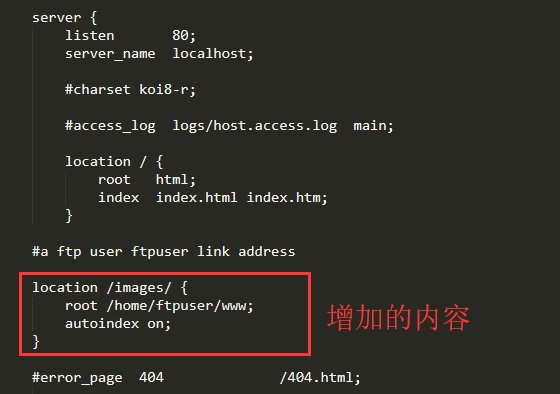
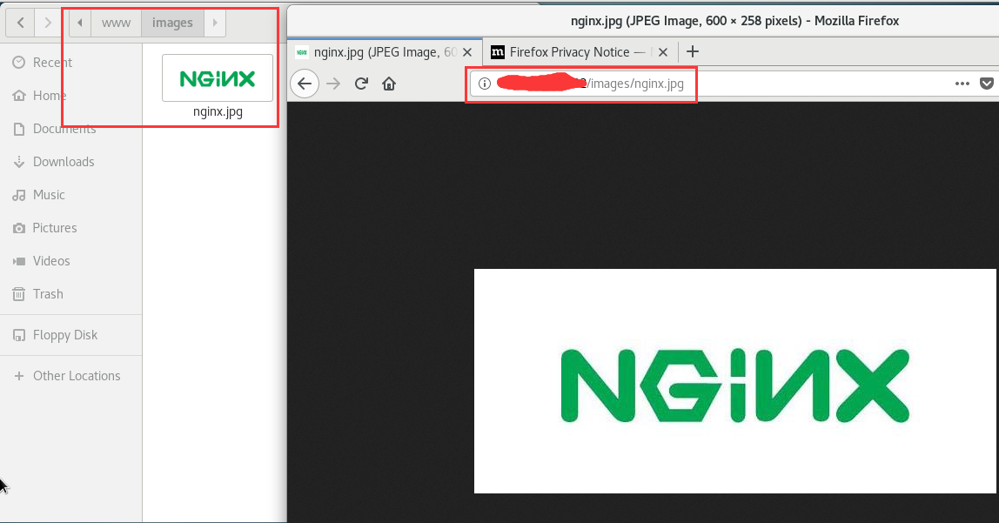

## 1 centos7上搭建ftp服务

### 1.1 安装ftp组件

使用yum安装ftp组件:

```shell
yum -y install vsftpd
```

### 1.2 添加ftp用户

添加一个用户名为ftpuser:

```shell
useradd ftpuser
passwd ftpuser
```

### 1.3 端口设置

ftp服务默认端口为21，通过修改iptables文件来开启21端口。

```shell
vim /etc/sysconfig/iptables
```

修改后的文件内容为：

```shell
# sample configuration for iptables service
# you can edit this manually or use system-config-firewall
# please do not ask us to add additional ports/services to this default configuration
*filter
:INPUT ACCEPT [0:0]
:FORWARD ACCEPT [0:0]
:OUTPUT ACCEPT [0:0]
-A INPUT -m state --state RELATED,ESTABLISHED -j ACCEPT
-A INPUT -p icmp -j ACCEPT
-A INPUT -i lo -j ACCEPT
-A INPUT -p tcp -m state --state NEW -m tcp --dport 21 -j ACCEPT
-A INPUT -p tcp -m state --state NEW -m tcp --dport 22 -j ACCEPT
-A INPUT -p tcp -m state --state NEW -m tcp --dport 137 -j ACCEPT
-A INPUT -p tcp -m state --state NEW -m tcp --dport 138 -j ACCEPT
-A INPUT -p tcp -m state --state NEW -m tcp --dport 139 -j ACCEPT
-A INPUT -p tcp -m state --state NEW -m tcp --dport 445 -j ACCEPT
-A INPUT -j REJECT --reject-with icmp-host-prohibited
-A FORWARD -j REJECT --reject-with icmp-host-prohibited
COMMIT
```

开启iptables服务

```shell
systemctl start iptables
```

### 1.4 关闭匿名访问

修改/etc/vsftpd/vsftpd.conf文件：

```shell
vim /etc/vsftpd/vsftpd.conf
```

修改的内容为：

```shell
anonymous_enable=NO
```

开启ftp服务：

```shell
systemctl start iptables
```

### 1.5 开启被动模式

编辑/etc/vsftpd/vsftpd.conf文件

```shell
vim /etc/vsftpd/vsftpd.conf
```

在文件末尾添加以下内容：

```shell
pasv_min_port=30000
pasv_max_port=30999
```

并修改iptables文件，修改后的文件内容为：

```shell
# sample configuration for iptables service
# you can edit this manually or use system-config-firewall
# please do not ask us to add additional ports/services to this default configuration
*filter
:INPUT ACCEPT [0:0]
:FORWARD ACCEPT [0:0]
:OUTPUT ACCEPT [0:0]
-A INPUT -m state --state RELATED,ESTABLISHED -j ACCEPT
-A INPUT -p icmp -j ACCEPT
-A INPUT -i lo -j ACCEPT
-A INPUT -p tcp -m state --state NEW -m tcp --dport 21 -j ACCEPT
-A INPUT -p tcp -m state --state NEW -m tcp --dport 22 -j ACCEPT
-A INPUT -p tcp -m state --state NEW -m tcp --dport 137 -j ACCEPT
-A INPUT -p tcp -m state --state NEW -m tcp --dport 138 -j ACCEPT
-A INPUT -p tcp -m state --state NEW -m tcp --dport 139 -j ACCEPT
-A INPUT -p tcp -m state --state NEW -m tcp --dport 445 -j ACCEPT
-A INPUT -p tcp -m state --state NEW -m tcp --dport 30000:30999 -j ACCEPT
-A INPUT -j REJECT --reject-with icmp-host-prohibited
-A FORWARD -j REJECT --reject-with icmp-host-prohibited
COMMIT
```

### 1.6 开机启动ftp服务

```shell
systemctl enable vsftpd
```

## 2 centos7上搭建nginx服务器

### 2.1 下载nginx的稳定版本

http://nginx.org/download/nginx-1.16.0.tar.gz

### 2.2 安装并搭建nginx

```
yum groupinstall -y "Development Tools"    #确保安装开发套件

mv /home/yangzhen/Downloads/nginx-1.16.0 tar.gz .    #将nginx安装包从下载目录移动到root用户的根目录

tar -xvf  nginx-1.16.0 tar.gz    #解压缩该文件

cd nginx-1.16.0            #打开安装包目录

./configure                #检查当前环境并生成makefile

yum list | grep pcre       #查看pcre是哪个包

yum install -y pcre-devel  #安装pcre的依赖包

./configure                #再次检查当前环境

yum list | grep zlib       #查看zlib是哪个包

yum install -y zlib-devel  #安装zlib的依赖包

./configure                #再次检查当前环境

make            #编译

make install    #安装

cd /usr/local/nginx/sbin   #打开nginx对应的目录

./nginx                    #启动nginx服务

netstat -tupln | grep 80   #查看当前运行的web服务
```

### 2.3 查看本地静态网站

nginx默认的html静态页面保存的位置是：/usr/local/nginx/html/index.html，在浏览器中输入127.0.0.1即可看到默认页面的效果。

## 3 nginx+ftp搭建图片服务器

### 3.1 添加实际路径

修改/usr/local/nginx/conf/nginx.conf文件，在默认的server里再添加一个location并指定实际路径，修改后的内容为：



重启nginx服务器：

```shell
./nginx -s reload
```

### 3.2 修改ftp用户权限

```shell
chown -R ftpuser:ftpuser /home/ftpuser
chmod 777 -R /home/ftpuser
```

此处注意一定要在图片复制到指定文件之后再修改权限。

### 3.3 访问测试



参考博客：<https://blog.csdn.net/maoyuanming0806/article/details/78067860>