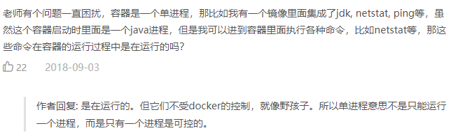

参考极客时间：https://time.geekbang.org/column/article/17921

### 1 什么是进程

程序执行后其就从磁盘上的二进制文件变成了计算机内存中的数据、寄存器里的值、堆栈中的指令、被打开的文件，以及各种设备的状态信息的一个集合，程序运行起来后计算机执行环境的总和就是进程。对于进程来说，它静态表现是程序 ，及在磁盘上；而一旦运行起来，变成计算机里的数据和状态的总和，即为进程的动态表现。

### 2 容器技术

容器技术的核心功能就是通过约束和修改进程的动态表现，为其创造出一个“边界”。对于docker等大多数linux容器来说，Cgroups技术是用来制造约束的主要手段，而Namespace技术是用来修改进程视图的主要方法。

启动一个容器，在容器中执行/bin/bash，并分配一个命令行终端与该容器交互：

```shell
docker run -it busybox /bin/sh
```

通过ps命令可以发现该容器内一共有两个进程：/bin/sh与ps，即已经被docker隔离在一个跟宿主机完全不同的世界中，并且显示bin/sh的进程编号PID=1。可实际上，他们在宿主机的操作系统里还是原来的100号进程，其实就是对被隔离应用的进程空间做了手脚，这种技术就是linux中的namespace机制。

在linux系统中创建一个新的进程：

```shell
int pid=clone(main_function,stack_size,CLONE_NEWPID | SIGCHLD, NULL)
```

指定CLONE_NEWPID参数，在创建新进程时就会“看到”一个全新的进程空间，该进程的PID为1。之所以用“看到”是因为这是一个“障眼法”，在宿主机真是的进程空间中，这个进程的PID是100。

除了PID Namespace, linux操作系统还提供mount、UTS、IPC、network和user等namespace，用来对各种不同的进程上下文进行“障眼法”操作。mount namespace用于让被隔离进程只看到当前namespace里的挂载点信息，network namespace用于让被隔离进程看到当前namespace里的网络设备和配置。这就是linux容器最基本的实现原理。

### 3 docker容器

docker容器实际就是创建容器进程时，指定这个进程所需要启动的一组namespace参数，容器只能看到当前namespace所限定的资源、文件、设备、状态或配置，而对于宿主机以及其他不相关的程序就完全看不到。

所以说，容器使一种特殊的进程。

在使用docker的时候，并没有一个正在的“docker容器”运行在宿主机里，docker项目帮助用户启动的还是原来的应用进程，只不过在创建这些进程时，docker为他们加上了各类namespace参数，这样进程就会觉得自己是各自PID namespace里的第1号进程，只能看到各自mount namespace里挂载的目录和文件，只能访问各自的network namespace里的网络设备，即仿佛运行在一个个容器里，与世隔绝。



### 4 容器与虚拟机

docker容器不像hypervisor那样对应用进程的隔离环境负责，也不会创建任何实体的“容器”，真正对隔离环境负责的是宿主机操作系统本身。用户运行在容器内的应用进程，跟宿主机上的其他进程一样，都由宿主机操作系统统一管理，只不过这些被隔离的进程拥有额外设置过的namespace参数，而docker项目在这里扮演的角色，更多的是旁路式的辅助和管理工作。


使用虚拟化技术作为应用沙盒，必须由hypervisor来负责创建虚拟机，该虚拟机真是存在，并且必须运行一个完整的Guest OS才能执行用户的应用进程，即不可避免的带来额外的资源消耗与占用。一个运行着Centos的虚拟机启动后，在无优化的情况下，虚拟机本身就需占用100-200MB内存。另外用户应用运行在虚拟机里，对操作系统的调用就不可避免地要经过虚拟化软件的拦截和处理，这又是一层性能损耗，尤其对计算资源、网络和磁盘IO的损耗非常大。

而容器化后的用户应用依然是一个在宿主机上的普通进程，意味着因为虚拟化而带来的性能损耗是不存在的；另一方面，使用namespace作为隔离手段的容器并不需要单独的Guest OS，使得namespace作为隔离手段的容器并不需要单独的Guest OS，即容器额外的资源占用几乎可以忽略不计。

敏捷和高性能是容器相较于虚拟机最大的优势，也是其能够在pass这种更细粒度的资源管理平台上大行其道的重要原因。

### 5 容器的隔离

既然容器只是运行在宿主机上的一种特殊进程，那么多个容器之间使用的还是同一个宿主机的操作系统内核。可以在容器里通过mount namespace单独挂载其它不同版本的操作系统文件，比如centos或Ubuntu，但这并不能改变共享宿主机内核的事实。即如果要在windows宿主机上运行linux容器，或者在低版本的linux宿主机上运行高版本的linux容器，都是行不通的。

在linux内核中，有很多资源和对象是不能被namespace化的，比如说时间。如果容器中的程序使用settimeofday(2)系统调用修改了时间，整个宿主机的时间都会被随之改变，这显然不符合用户的预期。相比于在虚拟机里面可以随便折腾的自由度，在容器里部署应用的时候，“什么能做，什么不能做”是用户必须考虑的一个问题。

基于虚拟化或者独立内核技术的容器实现，可以比较好地在隔离和性能之间做出平衡。

### 6 容器的限制

容器内的第1号进程在障眼法的干扰下只能看到容器里的情况，但在宿主机上，它作为第100号进程与其他所有进程之间依然是平等的竞争关系。虽然第100号进程被隔离了起来，但是它所能使用的CPU、内存等资源，却可以随时被宿主机上的其它进程或容器占用。另外这个100号进程自己也可能把所有资源吃光，这显然不是一个沙盒应该表现出来的合理行为。

linux cgroup（Linux Control Group）是linux内核中用来为进程设置资源限制的一个重要功能，它最主要的作用就是限制一个进程组能够使用的资源上限，包括CPU、内存、磁盘、网络带宽等，还能对进程进行优先级设置、审计，以及将进程挂起和回复等操作。

在linux中，Cgroup给用户暴露出来的操作接口是文件系统，即它以文件和目录的方式组织在操作系统的/sys/fs/cgroup路径下，通过mount -t cgroup 指令可以展示出来。

在/sys/fs/cgroup下面有诸多cpuset、cpu、memory的子系统，这些即为cgroup进行限制的资源种类，在子系统对应的资源种类下，可以看到该类资源具体可以被限制的方法。其中cfs_period和cfs_quota两个参数需要组合使用，用来限制进程在长度为cfs_period的时间内，只能被分配到总量为cfs_quota的CPU时间。

除CPU子系统外，cgroup的每个子系统都有其独有的资源限制能力，例如：

bliko，为块设备设定I/O限制，一般用于磁盘等设备；

cpuset，为进程分配单独的CPU核和对应的内存节点；

memory，为进程设定内存使用的限制。

linux cgroup的设计比较易用，是一个子系统目录加上一组资源限制文件的组合。对于docker等linux容器项目来说，它们只需在每个子系统下面为每个容器创建一个控制组（即创建一个新目录），在启动容器进程之后，把这个进程的PID填写到对应控制组的tasks文件中即可。而至于在这些控制组下面资源文件里填写什么值，可以通过docker run命令的参数指定。

```shell
docker run -it --cpu-period=100000 --cpu-quota=20000 ubuntu /bin/sh
```

### 7 总结

一个正在运行的docker容器，其实就是一个启用多个linux namespace的应用进程，而这个进程能够使用的资源量，则受cgroup配置的限制，即容器是一个“单进程”模型。

容器本身的设计最好能够同其应用同生命周期，这个概念对后续的容器编排非常重要。一旦出现类似于“容器正常运行而应用早已挂了”的情况，编排系统处理就非常麻烦。

与namespace的情况类似，cgroup对资源的限制能力也有很多不完善的地方，被提及最多的自然是/proc文件系统的问题，/proc目录存储的是记录当前内核运行状态的一系列特殊文件，用户可通过访问这些文件，查看系统及当前正在运行的进程信息。但是因为/proc文件系统并不知道用户通过cgroup给容器做了什么样的资源限制，即/proc文件系统不了解cgroup限制的存在。