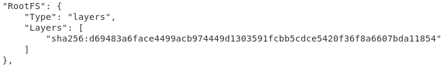

参考极客时间：https://time.geekbang.org/column/article/17921

### 1 容器的文件系统

mount namespace修改的，是容器进程对文件系统挂载点的认知。这也意味着，只有在挂载这个操作发生之后，进程的视图才会被改变。而在此之前，新创建的容器会直接继承宿主机的各个挂载点。

mount namespace跟其他namespace的使用略有不同的地方：它对容器进程视图的改变，一定是伴随着挂载操作才能生效。

实际上mount namespace正是基于对chroot的不断改良才被发明出来的，也是linux操作系统里的第一个namespace。这个挂载在容器根目录上，用来为容器进程提供隔离后执行环境的文件系统就是所谓的“容器镜像”，也叫做rootfs根文件系统。一个最常见的rootfs或者说容器镜像，会包括bin、etc、proc等目录文件。rootfs只是一个操作系统所包含的文件、配置和目录，并不包含操作系统内核。在linux操作系统中，这两部分是分开存放的，操作系统只有在开机启动时才会加载指定版本的内核镜像。即rootfs只包括操作系统的“躯壳”。并不包含操作系统的“灵魂”。

对于docker项目来说，最核心的原理实际上就是为待创建的用户进程：

1、启动linux namespace配置

2、设置指定的cgroups参数

3、切换进程的根目录（change root）

同一个机器上的所有容器都共享宿主机操作系统的内核，如果某一应用程序需要配置内核参数，加载额外的内核模块，以及跟内核镜像交互，这些操作和依赖的对象，都是宿主机操作系统的内核，对于该机器上的所有容器都是一个全局变量，牵一发而动全身。

### 2 容器的一致性

正是由于rootfs的存在，容器才有一致性的重要特性。由于roots里打包的不只是应用，而是整个操作系统的文件和目录，即应用和它运行所需要的所有依赖都被封装在一起，对一个应用来说，操作系统本身才是它运行所需要的最完整的依赖库。

容器的一致性：无论在本地、云端还是在一台任何地方的机器上，用户只需要解压打包好的容器镜像，那么这个应用运行所需要的完整执行环境就被重现出来了。这种深入到操作系统级别的运行环境一致性，打通了应用在本地开发和远端执行环境之间难以逾越的鸿沟。

### 3 镜像中层的概念

docker在镜像的设计中，引入层的概念，即用户制作镜像的每一步操作，都会生成一个层，也就是一个增量rootfs。层的实现用到了一种叫作联合文件系统（union file system）的能力，UnionFS最主要的功能是将多个不同位置的目录联合挂载到同一目录下。在docker容器中，默认使用aufs这个联合文件系统进行实现。

通过以下命令可以查看不同操作系统的docker镜像，比如centos

```shell
docker image inspect centos:latest
```

看到的结果为：



容器的rootfs由三部分组成：

1. 只读层：容器rootfs最下面的几层，以只读（ro+wh，即readonly+whiteout）的方式挂载，这些层都以增量的方式分别包含了操作系统的一部分；
2. 可读写层：rootfs最上面的一层，以rw(read write)的方式挂载，在没写入文件之前这个目录是空的，一旦在容器中做了写操作，修改产生的内容就以增量的方式出现在该层中；不管是增、删、改都出现在这里，增加和修改都比较好理解，删除的化时间上是在可读写层创建了一个名叫.wh.foo的文件，当这两个层被联合挂载之后，foo文件就会被.wh.foo文件“遮挡”起来，“消失”了，这是“ro+wh”的挂载方式。
3. init层：以-init结尾的层，夹在只读层和读写层之间，init层是docker项目单独生成的一个内部层，专门用来存放/etc/hosts、/etc/reslov.conf等信息。

在修改了这些文件后，以一个单独的层挂载出来，用户执行docker commit只会提交可读写层。

容器镜像的发明，不仅打通了“开发-测试-部署”流程的每一个环节，更重要的是容器镜像将会成为未来软件的主流发布方式。

